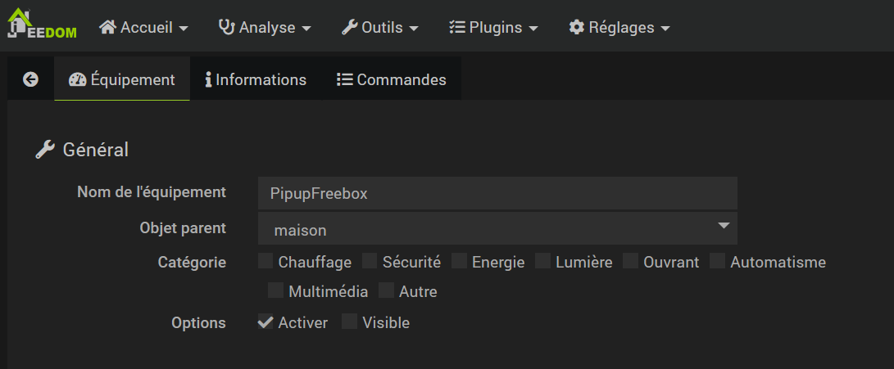
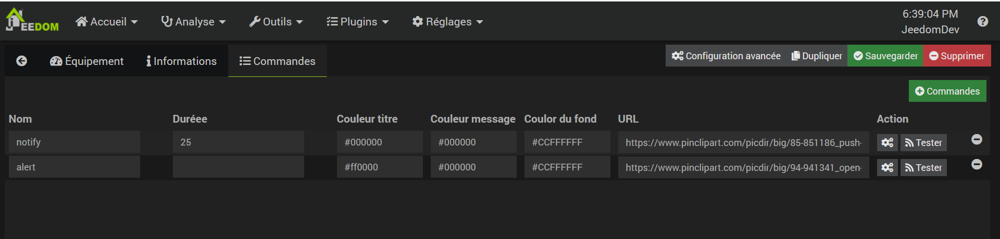

# Plugin PiPup
Ce plugin permet de créer une notification sur Android TV via l'application [Android PiPup de rogro82](https://github.com/rogro82/PiPup).

# Prérequis
Le plugin est basé sur une application AndroidTV : PiPup. (https://github.com/rogro82/PiPup)
- Installer sur la TV l'application PiPup.
- Activer le mode développeur sur la TV
`Paramètres > Préférences > A propos`
Cliquer plusieurs fois sur "Build" jusqu'à activer le mode développeur

## Via PC ou MAC :
- Sur son PC ou son MAC, il faut récupérer l'outil adb (https://developer.android.com/studio/releases/platform-tools)

- Puis via une ligne de commande, se connecter à sa TV. Si son IP est IPTV :
`adb connect IPTV`

- Vérification :
`adb devices`

- Donner les droits d'afficher une popup sur la TV pour cette application :
`adb shell appops set nl.rogro82.pipup SYSTEM_ALERT_WINDOW allow`

## Via Smartphone Android :
- Installer et ouvrir l'application Remote ADB Shell sur le smartphone.
- Saisir l'adresse ip de l'Android TV et valider.
- Accepter la connexion sur la TV.
- Exécuter la commande 
`appops set nl.rogro82.pipup SYSTEM_ALERT_WINDOW allow` sur l'application du smartphone.

- Donner les droits d'afficher une popup sur la TV pour cette application.
 

# Configuration des équipements
 

La configuration des équipements PiPup est accessible à partir du menu Plugins puis Communication.

Une fois dessus, vous retrouvez alors la liste de vos équipements.

  

## Général

  

Vous retrouvez ici toute la configuration de votre équipement :

  

  

- Nom de l’équipement : nom de votre équipement AndroidTV.

- Objet parent : indique l’objet parent auquel appartient l’équipement.

- Catégorie : les catégories de l’équipement (il peut appartenir à plusieurs catégories).

- Activer : permet de rendre votre équipement actif.

- Visible : le rend visible sur le dashboard.

  

## Informations

  

Cet onglet permet de définir l'équipement :

  

  

- IP TV : IP de l'équipement où afficher les notifications

- Durée : Durée en seconde pendant laquelle la notification s'affiche. 30 secondes par défaut.

- Position : Emplacement où s'afficheront les notifications. En bas à droite par défaut.

- Taille du titre : 20 par défaut

- Taille du message : 14 par défaut

- Taille de l'image : 240 par défaut

- Web : largeur : 640 par défaut

- Web : hauteur : 480 par défaut

  

## Commandes

  

Ci-dessous, vous retrouvez la liste des commandes :

  

  

Commandes créées pour voir des informations :

- notify : affiche une notification de type Notify

- alert : affiche une notification de type Alert

  

Les commandes sont personnalisables :

- Durée : durée en seconde. optionel, peux surcharger la valeur globale précédemment renseignée

- Type : type du média (image, web)

- Couleur titre : couleur du titre

- Couleur message : couleur du texte du message

- Couleur du fond : couleur de fond

- URL : URL de l'image. Si vide, il n'y a pas d'image affichée.

Exemple :

https://www.pinclipart.com/picdir/big/85-851186_push-notifications-push-notification-icon-png-clipart.png

https://www.pinclipart.com/picdir/big/94-941341_open-animated-gif-alert-icon-clipart.png

https://jeannedarcroye.files.wordpress.com/2019/01/attention-2.gif

Un GIF animé peut être choisi.

  

Note : Il est possible de jouer sur la transparence (du fond par exemple)

Les valeurs "color" sont dans le format [AA]RRGGBB où le canal alpha (transparence) est optionelle.

Exemple : la valeur du fond peut-être #FFFFFF (blanc) ou #CCFFFFFF (blanc avec transparence)

  

Note 2 : Pour trouver la couleur souhaité au format HEX, il est possible d'utiliser des site web du genre :

https://www.peko-step.com/fr/tool/tfcolor.html

  

Note 3 : Il est possible de faire juste apparaitre l'icône ou la page Web.

Il suffit de ne pas renseigner le titre le message.
